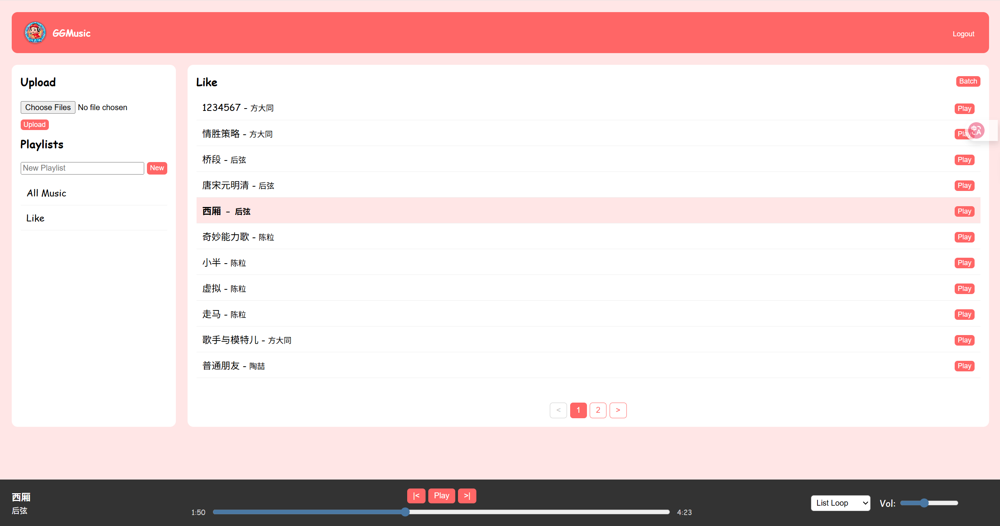

# 🎵 GGMusic - 你的私人云音乐网盘

> 一个轻量级、响应式的个人音乐流媒体服务器，基于 Spring Boot 和 Thymeleaf 构建。支持上传、在线播放、歌单管理以及移动端适配。




## ✨ 核心功能

*   **🎧 在线播放器**：支持 MP3/M4A/WAV 格式，具备进度条拖拽、音量调节功能。
*   **📱 全端适配**：响应式设计，完美适配 PC 端和移动端（手机/平板）。
*   **📂 智能上传**：
    *   支持批量上传。
    *   **自动解析**文件名（格式：`歌手 - 歌名.mp3`），自动填充元数据。
*   **📑 歌单管理**：
    *   创建自定义歌单。
    *   **批量操作**：支持批量添加歌曲到歌单、批量从歌单移除。
    *   **彻底删除**：支持从服务器物理删除文件及数据库记录。
*   **🔁 播放模式**：支持列表循环、单曲循环、随机播放。
*   **🔍 智能排序**：歌曲列表自动按歌名字典序排序。
*   **🔒 安全机制**：基于 Spring Security 的登录/注册系统，CSRF 防护。

## 🛠️ 技术栈

*   **后端**：Java 17, Spring Boot 3, Spring Data JPA, Spring Security
*   **数据库**：MySQL 8.0
*   **前端**：Thymeleaf, HTML5, CSS3 (Flexbox), Vanilla JavaScript
*   **构建工具**：Maven

## 🚀 快速开始

### 1. 环境要求
*   JDK 17+
*   MySQL 8.0+

### 2. 数据库配置
创建一个名为 `ggmusic` 的数据库：
```sql
CREATE DATABASE ggmusic CHARACTER SET utf8mb4 COLLATE utf8mb4_unicode_ci;
```

修改 `src/main/resources/application.properties` 中的数据库连接信息：
```properties
spring.datasource.url=jdbc:mysql://localhost:3306/ggmusic...
spring.datasource.username=your_username
spring.datasource.password=your_password
```

### 3. 文件存储配置
修改 `application.properties` 中的上传路径：
```properties
# Windows 本地开发
app.upload.dir=D:/ggmusic_data/

# Linux 服务器部署
# app.upload.dir=/root/ggmusic_data/
```

### 4. 运行项目
```bash
# 克隆项目
git clone https://github.com/yourusername/GGMusic.git

# 进入目录
cd GGMusic

# 打包
mvn clean package -DskipTests

# 运行
java -jar target/GGMusic-0.0.1-SNAPSHOT.jar
```
访问 `http://localhost:8080` 即可开始使用。

## 📦 服务器部署 (Linux)

建议使用低内存模式运行（适用于 1G 内存服务器）：

```bash
nohup java -Xmx256m -jar GGMusic-0.0.1-SNAPSHOT.jar > ggmusic.log 2>&1 &
```

 
## 📄 许可证
本项目采用 [MIT](LICENSE) 许可证。
